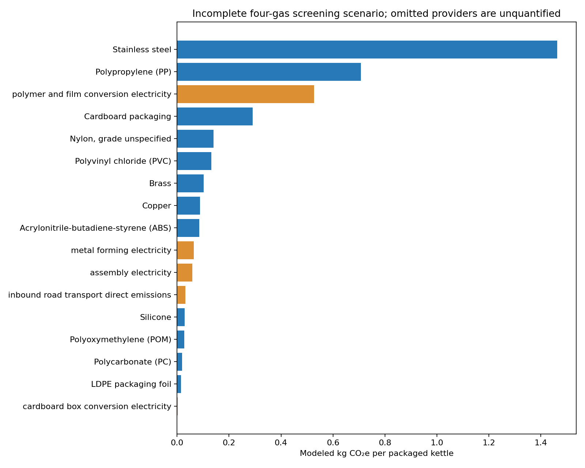

# BC1 1 L plastic electric kettle: LCA study record

**Calculated screening scenario:** **3.784 kg CO₂e per manufactured and packaged kettle** for `screening-2026-10-08-v1`. This is a numerical **four-gas, proxy-based modeled subtotal**, **not a verified complete cradle-to-factory-gate GWP100 result**. The selected public inventories leave 1,281 upstream provider-input rows unlinked across the eight USLCI profiles, and several materials and factory activities use explicit proxies. Their omitted effects are **unquantified, not zero**. Do not use 3.784 kg CO₂e as a final product carbon footprint or comparative assertion.



## 1. Study identity and purpose

| Item | Recorded information |
| --- | --- |
| Title | BC1 1 L plastic electric kettle, cradle-to-factory-gate screening LCA |
| Public student/group alias | Unknown; none supplied for public use |
| Repository | <https://github.com/yeonwoo1234/Kettle_LCA> |
| Run identifier | `screening-2026-10-08-v1` |
| Study/run date | 2026-10-08 (Asia/Seoul); date of the scripted screening calculation |
| Goal | Estimate the climate impact of one manufactured and packaged kettle through the factory gate, with incomplete-provider and proxy limitations visible |
| Intended comparison | Unknown; no product alternative or comparative hypothesis was supplied |
| Independent/revised run and Git tag | First recorded numerical screening run; no earlier independent LCA output, revision or tag exists |

A final 40-character commit SHA must be submitted in the course form **after** committing. It cannot be embedded in this README's own future commit. A full name and email belong in the form, not this public repository.

## 2. Product, declared unit and system boundary

The **declared unit** is **one manufactured and packaged BC1 1 L plastic electric kettle at the factory gate**. The course [Decision Lab brief](https://tiangong-lca-decision-lab.ecodino73.chatgpt.site/) attributes the shared BOM to the *EU Electric Kettles preparatory study* (2020), Task 4, Tables 4-3, 4-4 and 4-8 (printed pp. 26, 27 and 30); this attribution was supplied by the page and the original study was not independently inspected in this run. BC1 is a representative base case, not a named commercial product. Power rating, dimensions, material grades, supplier and plant specifications are unknown. The student confirmed that the 12 BOM entries cover the complete kettle and packaging. The masses were supplied in this conversation on 2026-10-08 and transcribed into [`data/bom.csv`](data/bom.csv); no separate dated engineering BOM or measurement record was supplied.

| Finished unit | Mass | Kilograms |
| --- | ---: | ---: |
| Kettle, 10 material rows | 723.0 g | 0.7230 kg |
| Packaging, 2 material rows | 137.8 g | 0.1378 kg |
| Packaged kettle, 12 rows | **860.8 g** | **0.8608 kg** |

The **intended** boundary includes extraction, materials production, inbound material transport, parts conversion, assembly and packaging. The **implemented screening model** covers selected material-production inventories, proxy conversion electricity, assumed assembly and metal-forming electricity, and assumed inbound road transport. It excludes any still-unlinked upstream suppliers, factory fuels or services not represented by these proxies, full waste treatment and material losses beyond the stated purchase multipliers. Distribution after the factory gate, consumer use and end-of-life are excluded; no separate use/end-of-life extension exists. There is no tested quantitative cut-off threshold. China is the assumed production geography; actual plant and suppliers are unknown. The background mixes **2010 Tiangong copper**, **2019 Tiangong electricity**, and **USLCI 1.2025-06.0** processes, so there is no single representative reference year.

## 3. Foreground inventory and quantitative assumptions

The exact 12 finished masses are in [`data/bom.csv`](data/bom.csv), all baseline scenario choices and their provenance are in [`data/scenario_assumptions.json`](data/scenario_assumptions.json), and calculated purchases and contributions are in [`results/material_contributions.csv`](results/material_contributions.csv).

| Parameter/input | Baseline value | Unit | Evidence/source | Status |
| --- | ---: | --- | --- | --- |
| Kettle finished mass | 0.7230 | kg/unit | Student BOM, 10-row sum | Student supplied; arithmetic checked |
| Packaging finished mass | 0.1378 | kg/unit | Student BOM, 2-row sum | Student supplied; arithmetic checked |
| Plastic/rubber purchase multiplier | 1.034 | kg purchase/kg finished | USLCI rigid PP injection process reports 1.034 kg PP per 1 kg molded part | Sourced for PP; proxy for other polymers and LDPE film |
| Cardboard purchase multiplier | 1.0326 | kg board/kg box | Tiangong corrugated-box process reports 1,032.6 kg board per 1,000 kg boxes | Sourced box proxy; packaging grade unknown |
| Metal purchase multiplier | 1.000 | kg purchase/kg finished | No metal scrap/yield data | Analyst assumption; omits metal forming loss |
| Total purchased material | **0.8823606** | kg/unit | BOM times multipliers | Calculated scenario value |
| Implied process scrap | **0.0215606** | kg/unit | Purchased minus finished material | Calculated mass difference; disposal impacts not modeled |
| Polymer/film conversion electricity | 6.444 MJ = 1.790 kWh | per kg finished polymer/film | USLCI rigid PP injection process; only its electricity exchange is transferred | PP-derived conversion proxy; resin and packaging exchanges are not added again |
| Metal forming electricity | 0.5 | kWh/kg finished metal | No BC1 production record | Analyst assumption |
| Cardboard box conversion electricity | 120.6324 MJ/1,000 kg | box output | Tiangong corrugated-box process | Sourced process proxy |
| Assembly electricity | 0.1 | kWh/kettle | No BC1 meter data | Analyst assumption |
| Chinese grid electricity factor | **0.5804066** | kg CO₂e/kWh | Tiangong 2019 China mix × national thermal generation direct emissions | Derived direct-generation proxy; upstream and nonthermal impacts unquantified |
| Inbound road distance | 500 | km | Supplier routes unknown | Analyst assumption applied to purchased mass |
| Truck factor | **0.0719015** | kg CO₂e/t·km | Four direct gas emissions from USLCI diesel combination-truck process | Sourced direct-emission proxy; fuel upstream unquantified |
| Brass composition | 70% Cu, 30% Zn | mass share | Brass grade unknown | Analyst composition proxy; alloy production omitted |
| Material prices | Not used | — | No monetary proxy in the calculation | Not applicable; USEEIO bridge processes were excluded |

Purchased mass is calculated as `finished mass × purchase multiplier`, not confused with the mass inside the packaged unit. Each material process is normalized to its dataset reference product and then scaled to the purchased kilograms. USLCI factors include linked supplier activities where a provider **and matching unit** were found. The program transfers only the electricity exchange from the PP molding process; adding its complete molded-part inventory to separate resin factors would double count the PP resin. A common Chinese grid proxy replaces USLCI electricity inputs. Other unlinked provider burdens remain unquantified, and there is no quantified scrap credit.

## 4. Background data and matching decisions

The complete 12-row record of dataset name, UUID, version, geography, available time metadata, reference flow/amount/unit, source URL, retrieval date, file SHA-256, proxy choice and limitation is [`data/background_mapping.csv`](data/background_mapping.csv). Derived process factors and provider-gap counts are in [`results/process_factors.csv`](results/process_factors.csv), with source archive/file hashes in [`results/source_manifest.csv`](results/source_manifest.csv). The earlier [BOM manifest](data/manifest.csv) remains a record of the student-supplied foreground file.

- **USLCI 1.2025-06.0 JSON-LD:** stainless 304 coil, zinc, PP, PVC, ABS, LDPE, polybutadiene rubber and corrugated board. These are North American, U.S. or global records, so their use for Chinese production is a geography proxy. The newer **1.2026-09.0** `.zolca` release was inspected, but the linked current JSON-LD catalog and API guide returned HTTP 403 in this environment; this calculation uses the pinned, downloadable 2025-06 JSON-LD archive. Its archive SHA-256 is checked by the script.
- **Tiangong archived 0.2.0:** a 2010 primary-copper process supplies **direct** climate emissions; 2019 Chinese national grid and thermal-power processes yield the grid direct-emission factor; a corrugated-box process supplies board purchase and conversion-electricity ratios. These XML files are read from a pinned Git commit. Tiangong's [data repository](https://github.com/tiangong-lca/data) says it is historical; the current platform was inaccessible here.
- **Exact search/selection record:** process names and reference products were searched for steel, brass, copper, PP, PVC, nylon/PA, POM, PC, ABS, silicone, LDPE, cardboard, grid electricity and molding. No suitable direct POM, PC, silicone-rubber or nylon-resin process was confirmed in these exports. USLCI's nylon/PC USEEIO bridge processes were rejected because a monetary model and defensible prices were unavailable. Tiangong's pollutant-only 2019 stainless, brass and PP records were rejected for climate factors because they contain no production inputs and no usable direct climate emissions. See the [decision log](docs/decision-log.md).
- **Proxies:** ABS resin stands in for nylon, POM and PC; polybutadiene rubber for silicone; a 70/30 copper/zinc mix for brass; PP molding electricity for other polymers and film. These chemistry, product-form and technology mismatches can materially change the total. The complete choices are labeled per row in the mapping and contribution files.

The script uses **unit-process inventories**, not published cumulative material factors. It links exact default providers, or a unique producer for a matching flow, and refuses a link when the units disagree. There are **1,281 active unlinked provider-input rows across the eight selected USLCI profiles**, exported to [`results/unlinked_providers.csv`](results/unlinked_providers.csv). These are not 1,281 distinct substances, and Tiangong copper's upstream inputs are additional gaps. Other external dependencies, avoided-product links and unmodeled waste treatment remain limitations. No monetary sector, currency, price year, purchaser/basic-price basis or price enters this run.

## 5. Calculation and impact-assessment methods

[`scripts/calculate_screening.py`](scripts/calculate_screening.py) builds a sparse technosphere matrix from 962 USLCI JSON-LD processes. It solves `A s = f` for 1 kg of each selected material reference product, applies direct elementary emissions plus the Chinese grid proxy to obtain `g = B s`, and applies four climate characterization factors to obtain the modeled `h = C g`. Missing or unit-incompatible providers are **omitted from the numerical subtotal and listed explicitly**, not asserted to have zero actual impact. The script then multiplies material factors by purchased kilograms, adds conversion/assembly electricity and road-transport direct emissions, and reports one packaged kettle.

The four gas factors are from the [Tiangong EF 3.1 climate-change method](https://github.com/tiangong-lca/data/blob/c50cab7961e0b0ca11c26a600bd4c90fea6c6c32/tiangong_lca_data/lciamethods/6209b35f-9447-40b5-b68c-a1099e3674a0.xml), which describes IPCC 2021 GWP100: fossil CO₂ **1**, fossil CH₄ **29.8**, N₂O **273** and SF₆ **25,200** kg CO₂e/kg emission. USLCI's unspecific “Carbon dioxide” and “Methane” air flows are **assumed fossil** for this screening calculation. Other climate-active gases, biogenic CO₂ accounting and land-use emissions are **not fully characterized**, so the number is a four-gas screen rather than a complete EF 3.1 or IPCC GWP100 result.

The USLCI source processes retain their documented allocation and avoided-product exchanges when a matching provider is available; this study does not establish a common allocation/system model across USLCI and Tiangong. A missing avoided-product provider does not produce a credit. Recycled content in supplied processes is inherited; no extra end-of-life recycling credit is modeled. Production scrap follows only the listed purchase multipliers, with no quantified treatment. No unsupported exchange is silently converted into a characterized zero.

## 6. How to reproduce the analysis

| Path | Contents |
| --- | --- |
| [`data/bom.csv`](data/bom.csv) | Student-supplied finished-mass inventory |
| [`data/scenario_assumptions.json`](data/scenario_assumptions.json) | Sourced ratios and analyst scenario assumptions |
| [`data/background_mapping.csv`](data/background_mapping.csv) | Full per-material match/proxy details |
| [`scripts/calculate_screening.py`](scripts/calculate_screening.py) and [`requirements.txt`](requirements.txt) | Deterministic calculation and Python dependencies |
| [`results/summary.json`](results/summary.json) | Run status, total, checks and uncertainty statistics |
| [`results/material_contributions.csv`](results/material_contributions.csv), [`results/stage_contributions.csv`](results/stage_contributions.csv), [`results/scope_contributions.csv`](results/scope_contributions.csv) | Complete numerical breakdown by material, stage and kettle/packaging scope |
| [`results/process_factors.csv`](results/process_factors.csv), [`results/unlinked_providers.csv`](results/unlinked_providers.csv) | Factor derivation and missing supplier evidence |
| [`results/source_manifest.csv`](results/source_manifest.csv), [`results/contributions.png`](results/contributions.png) | Source hashes and chart |
| [`docs/decision-log.md`](docs/decision-log.md) | Curated public prompt, selection and decision record |

The run was tested on Linux with **Python 3.12.14**, **NumPy 2.3.5**, **SciPy 1.17.0** and **Matplotlib 3.10.8**. From the checkout root, with network access to GitHub Raw:

```bash
python3 -m pip install -r requirements.txt
python3 scripts/calculate_screening.py
python3 -m json.tool results/summary.json
```

The script downloads the pinned USLCI archive to `/tmp/kettle-lca-uslci/` if absent, validates its SHA-256, retrieves five pinned Tiangong XML files, and writes the listed `results/` outputs. It accepts `--uslci-archive PATH` and `--tiangong-root PATH` for existing local sources; neither source archive nor a restricted database dump is committed. Open `results/contributions.png` as an image and the CSV files in a spreadsheet or text editor. No account, API key, environment-variable value or credential is used. Data-use permissions must be checked against each source's terms before redistribution. The uncertainty simulation seed is **20261008**. Manual steps remaining for a complete LCA are finding missing supplier data, obtaining BC1 factory records, selecting a consistent full LCIA method/system model, and re-running the calculation.

## 7. Results, checks and interpretation

| Quantity or check | Result for `screening-2026-10-08-v1` |
| --- | ---: |
| **Modeled four-gas screening subtotal** | **3.784118 kg CO₂e/packaged kettle** |
| Materials and material proxies | 3.099763 kg CO₂e |
| Conversion, metal forming and assembly electricity | 0.652633 kg CO₂e |
| Inbound road transport, direct emissions | 0.031722 kg CO₂e |
| Kettle subtotal, including allocated processing and transport | 3.463594 kg CO₂e |
| Packaging subtotal, including allocated processing and transport | 0.320524 kg CO₂e |
| Complete cradle-to-factory-gate GWP100 total | **Not calculated**; missing provider, process and gas impacts are unquantified |
| Finished-mass check | **Passed:** 0.7230 + 0.1378 = 0.8608 kg |
| Purchase-mass arithmetic | **Passed:** 0.8823606 kg under stated multipliers |
| Implied process scrap | **0.0215606 kg**, with no modeled scrap treatment |
| Contribution-sum check | **Passed:** modeled rows sum to 3.784118 kg CO₂e |
| Kettle-plus-packaging check | **Passed:** 3.463594 + 0.320524 = 3.784118 kg CO₂e (using unrounded values) |
| Supplier closure | **Failed for a complete LCA:** 1,281 active USLCI unlinked provider-input rows across profiles, plus Tiangong copper upstream gaps |
| Full climate-flow characterization | **Failed for a complete GWP100:** only four gases characterized; generic biogenic/fossil identities unresolved |
| Double-counting review | PP resin and molding electricity separated; complete database-wide review is not possible with missing providers |

The top three **modeled** contributors are stainless steel **1.463004**, PP **0.707208**, and polymer/film conversion electricity **0.527827 kg CO₂e/unit**. The full 12-material and six-stage breakdown and chart are linked above. This run has no revised scenario or database/method comparison. Those ranks describe only modeled contributions; an omitted provider could change them. No product improvement, Chinese factory-specific footprint or comparative claim is supported.

## 8. Uncertainty and sensitivity

A **10,000-draw** conditional Monte Carlo simulation used seed **20261008**. Direct USLCI profile factors were independently sampled from triangular multipliers **0.75/1/1.25**; the shared ABS factor links ABS, nylon, POM and PC, while their additional proxy-ratio draws use **0.75/1/1.75**. The copper direct factor used **1/1.2/2**; the Chinese grid factor **0.8/1/1.2**; plastic and cardboard purchase multipliers **1.0/baseline/1.10**. Brass copper share was uniform **0.6–0.8**, road distance uniform **100–1,000 km**, and factory-energy assumptions varied as coded in the [script](scripts/calculate_screening.py). Distributions are **analyst scenario ranges**, not fitted empirical uncertainties. Common source factors and the grid draw create dependence among rows; otherwise draws are independent.

| Conditional modeled-subtotal statistic | kg CO₂e/packaged kettle |
| --- | ---: |
| Mean | 3.918397 |
| Median | 3.916658 |
| P05 | 3.563442 |
| P95 | 4.279371 |

The first- versus second-half simulated means differ by about **0.0022%**, a numerical stability check. The P05–P95 span is a **central 90% interval conditional on this truncated model and assumed distributions**. It does **not** cover missing suppliers, uncharacterized gases, incompatible methods, actual factory variability or variation between repeated AI runs. No independent repeated AI run exists.

## 9. Codex and human decisions

Codex assisted with source inspection, dataset/proxy selection, scripting, numerical checks and documentation on **2026-10-08**. This session identifies the assistant as Codex based on **GPT-6**; exact application build, inference settings and full prompt history are not captured here and remain unknown. The consequential public instructions, student clarifications and accepted/rejected choices are in [`docs/decision-log.md`](docs/decision-log.md), without private messages or credentials.

The student supplied the 12 masses, confirmed the electric kettle and complete BOM, selected China as a planning geography, and authorized a provisional estimate with explicit proxies. Codex chose the particular process matches and analyst values in [`data/scenario_assumptions.json`](data/scenario_assumptions.json). There are no recorded student manual edits to the model. BOM sums, source hashes, solver finiteness, result sums and exact rerun equality were checked; **no independent expert review of impacts or supplier completeness occurred**.

## 10. Independent and revised runs

The first preserved numeric output is this **screening** run, stored under [`results/`](results/summary.json). No earlier full independent LCA output or numeric baseline was present, and no Git tag was assigned at preparation time. The submitted 40-character Git commit SHA identifies the preserved version; it belongs in the course form rather than this self-referential README. There is **no revision**, so a prior commit, one changed decision, predicted effect, before/after numerical differences and a corrected-error versus alternative-model explanation are not applicable. Preserve these outputs before any class comparison, and record a future revision as a separate run rather than overwriting this one.

The course page asks students to predict the main contributor *before* calculation. No dated pre-calculation prediction was recorded, so one cannot be reconstructed retrospectively. A class comparison and one-change revision also require classmates' results and a recorded new modeling decision; neither is available at this independent-run submission stage. The [site requirements audit](docs/site-requirements-audit.md) lists these follow-up items.
